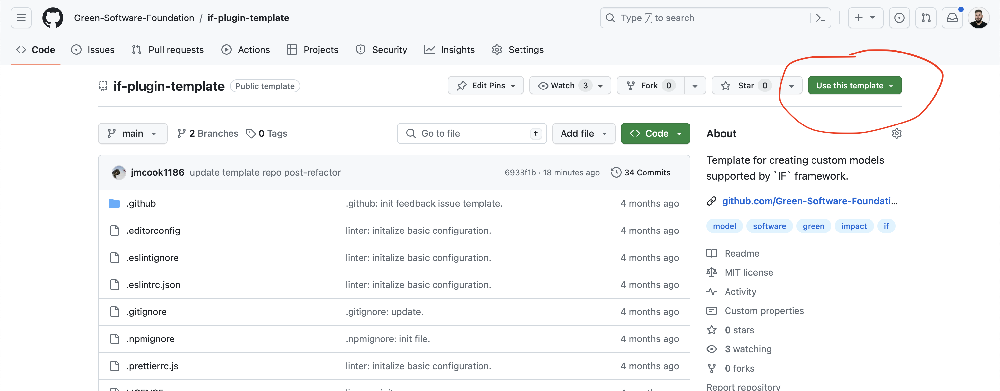

# How to build plugins

The IF is designed to be as composable as possible. This means you can develop your own plugins and use them in a pipeline.
To help developers write Typescript plugins to integrate easily into IF, we provide the `PluginFactory` interface. Here's an overview of the stages you need to follow to integrate your plugin:

- create a Typescript file that implements the `PluginFactory` from [`if-core`](https://github.com/Green-Software-Foundation/if-core)
- install the plugin
- initialize and invoke the plugin in your manifest file

## Step 1: Use our template repository

Instead of building up your plugin repository and all the configuration from scratch, you can use our [plugin template repository](https://github.com/Green-Software-Foundation/if-plugin-template). To use the template, visit the Github repository and click the `Use this template` button. You will have the option to `create a new repository` under your own account. Then, you can clone that repository to your local machine.



Inside that repository, all you have to do is run `npm install typescript` in the template folder, rename the project in `package.json` and write your plugin code inside `index.ts`. All the configuration and setup is taken care of for you.

## Step 2: Writing your plugin code

Now your project is setup, you can focus on your plugin logic. The entry point for your plugin is `index.ts`. In this guide it is assumed that all your plugin logic is in `index.ts` but depending on the copmplexity of your plugin you might want to split the code across multiple files. `index.ts` should always be your entry point, though.

The following sections describe the rules your plugin code should conform to. We also have an [appendix](#appendix-walk-through-of-the-sum-plugin) that deep dives a real plugin.

### Plugin interface

Your plugin must implement the `PluginFactory` interface, which is a higher-order function that takes a `params` object of type `PluginFactoryParams`. This factory function returns another function (referred to as the "inner function") that manages the plugin’s `config`, `parametersMetadata`, and `mapping`.

The `PluginFactory` is structured as follows:

```ts
export const PluginFactory =
  <C = ConfigParams>(params: PluginFactoryParams<C>) =>
  (
    config: C = {} as C,
    parametersMetadata: PluginParametersMetadata,
    mapping: MappingParams
  ) => ({
    metadata: {
      inputs: {...params.metadata.inputs, ...parametersMetadata?.inputs},
      outputs: parametersMetadata?.outputs || params.metadata.outputs,
    },
    execute: async (inputs: PluginParams[]) => {
      // Generic plugin functionality goes here
      // E.g., mapping, arithmetic operations, validation
      // Process inputs and mapping logic
    });
  });
```

The inner function returned by the `PluginFactory` handles the following parameters:

- **`config`**: An object of type `ConfigParams`. This parameter holds the configuration settings for the plugin and defaults to an empty object (`{}`).
- **`parametersMetadata`**: An object of type `PluginParametersMetadata` that contains metadata describing the plugin’s parameters.
- **`mapping`**: A `MappingParams` object that outlines how plugin parameters are mapped.

### Config

The `config` object is passed as an argument to your plugin and can be handled as shown in the example above. The structure of the config depends on what is defined in the manifest file. For example, the `Sci` plugin has access to `input-parameters` and `output-parameter` fields in its global configuration, as defined in the `Initialize` block of the manifest file:

```yaml
initialize:
  plugins:
    sum:
      method: Sci
      path: 'builtin'
      config:
        input-parameters: ['cpu/energy', 'network/energy']
        output-parameter: 'energy'
```

### Parameter metadata

The `parameter-metadata` is passed as an argument to the plugin as the config. It contains information about the `description`, `unit` and `aggregation-method` of the parameters of the inputs and outputs that defined in the manifest.

```yaml
initialize:
  plugins:
    sum:
      method: Sci
      path: 'builtin'
      config:
        input-parameters: ['cpu/energy', 'network/energy']
        output-parameter: 'energy-sum'
      parameter-metadata:
        inputs:
          cpu/energy:
            description: energy consumed by the cpu
            unit: kWh
            aggregation-method:
              time: sum
              component: sum
          network/energy:
            description: energy consumed by data ingress and egress
            unit: kWh
            aggregation-method:
              time: sum
              component: sum
        outputs:
          energy-sum:
            description: sum of energy components
            unit: kWh
            aggregation-method:
              time: sum
              component: sum
```

### Mapping

The `mapping` is an optional argument passed to the plugin. Its purpose is to rename the arguments expected or returned from the plugin as part of the plugin's execution, avoiding the need to use additional plugins to rename parameters.

For example, your plugin might expect `cpu/energy` and your input data has the parameter `cpu-energy` returned from another plugin. Instead of using an additional plugin to rename the parameter and add a new one, you can use `mapping` to:

a) rename the output from the first plugin so that `cpu/energy` is returned instead of the default `cpu-energy`

b) instruct the second plugin to accept `cpu-energy` instead of the default `cpu/energy`

The `mapping` config is an object with key-value pairs, where the `key` is the 'original' parameter name that the plugin uses, and the `value` is the 'new' name that you want to use instead.
The `mapping` block is an optional and allows mapping the input and output parameters of the plugin. The structure of the `mapping` block is:

```yaml
name: sci
description: successful path
tags:
initialize:
  plugins:
    sci:
      kind: plugin
      method: Sci
      path: 'builtin'
      config:
        functional-unit: requests
      mapping:
        sci: if-sci
tree:
  children:
    child:
      pipeline:
        compute:
          - sci
      inputs:
        - timestamp: 2023-07-06T00:00
          duration: 3600
          energy: 5
          carbon-operational: 5
          carbon-embodied: 0.02
          carbon: 5.02
          requests: 100
```

In the `outputs`, the `sci` value returned by the `Sci` plugin will be named `if-sci`.

### Plugin example

Here’s a minimal example of a plugin that sums inputs based on the configuration:

```ts
export const Plugin = PluginFactory({
  metadata: {
    inputs: {
      // Define your input parameters here
    },
    outputs: {
      // Define your output parameters here
    },
  },
  configValidation: (config: ConfigParams) => {
    // Implement validation logic for config here
  },
  inputValidation: (input: PluginParams, config: ConfigParams) => {
    // Implement validation logic for inputs here
  },
  implementation: async (inputs: PluginParams[], config: ConfigParams) => {
    // Implement plugin logic here
    // e.g., summing input parameters
  },
  allowArithmeticExpressions: [],
});

const plugin = Plugin(config, parametersMetadata, mapping);
const result = await plugin.execute(inputs);
```

### PluginFactoryParams

The `PluginFactory` interface requires the mandatory parameters defined in the `PluginFactoryParams` interface:

```ts
export interface PluginFactoryParams<C = ConfigParams> {
  implementation: (
    inputs: PluginParams[],
    config: C,
    mapping?: MappingParams
  ) => Promise<PluginParams[]>;
  metadata?: PluginParametersMetadata;
  configValidation?: z.ZodSchema | ConfigValidatorFunction;
  inputValidation?: z.ZodSchema | InputValidatorFunction;
  allowArithmeticExpressions?: string[];
}
```

Additional Notes

- `Implement`: You should implement `implementation` function. It should contains the primary logic to generate outputs.
- `Validation`: You should define appropriate `zod` schemas or validation functions for both config and inputs. This ensures that invalid data is caught early and handled appropriately.
- `Arithmetic Expressions`: By including configuration, input, and output parameters of the plugin in the `allowArithmeticExpressions` array, you enable dynamic evaluation of mathematical expressions within parameter values. This eliminates the need for manual pre-calculation and allows basic mathematical operations to be embedded directly within parameter values in manifest files. More details [here.](../reference/features.md)
- `Mapping`: Ensure your plugin correctly handles the mapping of parameters. This is essential when working with dynamic input and output configurations.

## Step 3: Install your plugin

Now your plugin code is written, you can install it to make it available to IF.

```sh
npm run build
```

Then use `npm link` to create a package that can be installed into IF:

```sh
npm link
```

## Step 4: Load your plugin into IF

Now your plugin is ready to run in IF. First install your plugin by navigating to the `if` project folder and running:

```sh
npm link new-plugin
```

replacing `new-plugin` with your plugin name as defined in the plugin's `package.json`. If you are not sure, the name can be checked by running `npm ls -g --depth=0 --link=true`.

Your plugin is now ready to be run in IF. All that remains is to add your plugin to your manifest file. This means adding it to the `initialize block` and adding it to the component pipelines where you want your plugin to be executed. For example, an `initilize` block might look as follows:

```yaml
initialize:
  plugins:
    new-plugin:
      method: YourFunctionName
      path: 'new-plugin'
      config:
        something: true
```

Run your manifest uisng

```sh
npm run if-run -- --manifest <path-to-manifest>
```

If you have to link more than one local plugin, for example to test your plugin in a pipeline, you can do so with

```sh
npm link new-plugin --save
```

This will create an entry like `"new-plugin": "file:path/to/your/plugin"` in the `package.json` which links to your local plugin. This way, multiple plugins can be linked at once. Of course, these changes should not be committed, but they can be helpful for local testing.

## Step 5: Publishing your plugin

Now you have run your plugin locally and you are happy with how it works, you can make it public by publishing it to a public Github repository. Now all you have to do to use it in a manifest file is `npm install` it and pass the path to the Github repository in the plugin `initialize` block.

For example, for a plugin saved in `github.com/my-repo/new-plugin` you can do the following:

```
npm install https://github.com/my-repo/new-plugin
```

Then, in your manifest file, provide the path in the plugin instantiation. You also need to specify which function the plugin instantiates. Let's say you are using the `Sci` plugin from the example above:

```yaml
name: plugin-demo
description: loads plugin
tags: null
initialize:
  plugins:
    new-plugin:
      method: FunctionName
      path: https://github.com/my-repo/new-plugin
tree:
  children:
    child:
      inputs:
```

Now, when you run the manifest file, it will load the plugin automatically.

You can run this using the globally installed IF as follows:

```sh
if-run --manifest <path-to-my-manifest>
```

## Summary of steps

- Copy our template repository and update `package.json`
- Add your plugin code to `index.ts`
- Build and link the plugin using `npm run build && npm link`
- Load your plugin into `if` using `npm link`
- Initialize your plugin and add it to a pipeline in your manifest file.
- Publish your plugin to Github

You should also create unit tests for your plugin to demonstrate correct execution and handling of corner cases.

## Next steps

You can read our more advanced guide on [how to refine your plugins](./how-to-refine-plugins.md).

## Appendix: Walk-through of the Sci plugin

To demonstrate how to build a plugin that conforms to the `PluginFactory`, let's examine the `Sum` plugin.

The `sum` plugin implements the following logic:

- sum whatever is provided in the `input-parameters` field from `config`.
- append the result to each element in the output array with the name provided as `output-parameter` in `config`.

Let's look at how you would implement this from scratch:

The plugin must be a function conforming to `PluginFactory`.

```ts
export const Sum = PluginFactory({
  configValidation: z.object({
    'input-parameters': z.array(z.string()),
    'output-parameter': z.string().min(1),
  }),
  inputValidation: (input: PluginParams, config: ConfigParams) => {
    return validate(validationSchema, inputData);
  },
  implementation: async (inputs: PluginParams[], config: ConfigParams) => {},
  allowArithmeticExpressions: [],
});
```

Your plugin now has the basic structure required for IF integration. Your next task is to add code to the body of `implementation` to enable the actual plugin logic to be implemented.

The `implementation` function should grab the `input-parameters` (the values to sum) from `config`. It should then iterate over the `inputs` array, get the values for each of the `input-parameters` and append them to the `inputs` array, using the name from the `output-parameter` value in `config`. Here's what this can look like, with the actual calculation pushed to a separate function, `calculateSum`.

```ts
{
  implementation: async (inputs: PluginParams[], config: ConfigParams) => {
    const {
      'input-parameters': inputParameters,
      'output-parameter': outputParameter,
    } = config;

    return inputs.map((input) => {
      const calculatedResult = calculateSum(input, inputParameters);

      return {
        ...input,
        [outputParameter]: calculatedResult,
      };
    });
  };
}
```

Now we just need to define what happens in `calculateSum` - this can be a simple `reduce`:

```ts
/**
 * Calculates the sum of the energy components.
 */
const calculateSum = (input: PluginParams, inputParameters: string[]) =>
  inputParameters.reduce(
    (accumulator, metricToSum) => accumulator + input[metricToSum],
    0
  );
```

Note that this example did not include any validation or error handling - you will likely want to add some for a real plugin.

## Managing errors

The IF framework provides its own set of error classes, making your task as a plugin builder much simpler! These are available to you in the `if-core` package that comes bundled with IF. You can import the appropriate error classes and add custom messages.
The [If Core](https://github.com/Green-Software-Foundation/if-core) repository contains the `PluginFactory` interface, utility functions, and a set of error classes that can be fully integrated with the IF framework. Detailed information on each error class can be found in the [Errors Reference](../reference/errors.md).

Now you are ready to run your plugin using the `if-run` CLI tool!
