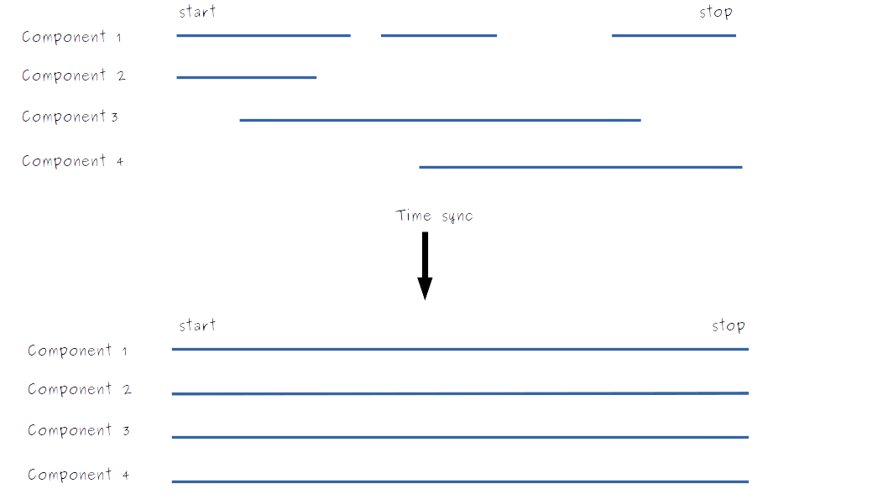

# Time

Every `observation` in an array of `inputs` represents a snapshot with a known start time and a known duration. For example, the following observation shows that the CPU utilization for a resource was 20% for the 10 second period starting at 1500 on the 22nd January 2024:

```yml
inputs:
  - timestamp: 2024-01-15T00:00:00.000Z
    duration: 10
    cpu-util: 20
```

The total time covered by an inputs array is determined by the timestamp of the first observation in the array and the timestamp and duration in the last observation in the array. Since every observation needs both a timestamp and a duration, an inputs array is always a time series.

# Synchronizing time series'

The time series for each component is defined by its inputs array. However, a manifest file can contain many separate components, each with their own time series. There is no guarantee that an individual time series is continuous, or that all the components in a manifest file have the same start time, end time and resolution. This makes it difficult to aggregate, visualize or do like-for-like comparisons between components.

To solve this problem, we provide a built-in `time-sync` feature that synchronizes the time series' across all the components in a tree. The time-sync feature takes a global start time, end time and interval, then forces every individual time series to conform to this configuration.

- This works by first upsampling each time series to a common base resolution (typically 1s).
- Any gaps in the time series are filled in with "zero objects", which have an identical structure to the real observations but with usage metrics set to zero (we assume that when there is no data, there is no usage).
- Next, we check to see whether the first timestamp in each time series is before, after or identical to the global start time.
- If a component's time series starts after the global start time, we pad the start of the time series with "zero objects" so that the start times are identical.
- If the component's time series starts _before_ the global start time, we trim the time series down, discarding observations from before the global start time. The same trimming logic is applied to the end times.
- After synchronizing the start and end times and padding any discontinuities, we have a set of continuous time series' of identical length.
- Next, we batch observations together into time bins whose size is define by the global `interval` value. This means that the resolution of the final time series' are identical and equal to `interval`.

This process yields synchronized time series for all components across a tree, enabling easy visualization and intercomparison. This synchronization is also a prerequisite for our aggregation function.



## Toggling off time sync

Some applications will not want to pad with zero values, and may be strict about continuous time series' being provided in the raw manifest file. In these cases, simply toggle the padding off in the manifest file.
